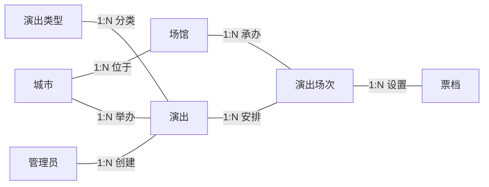
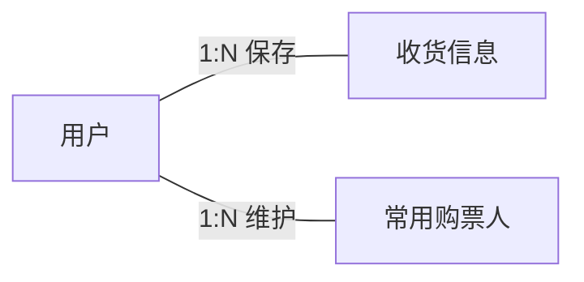
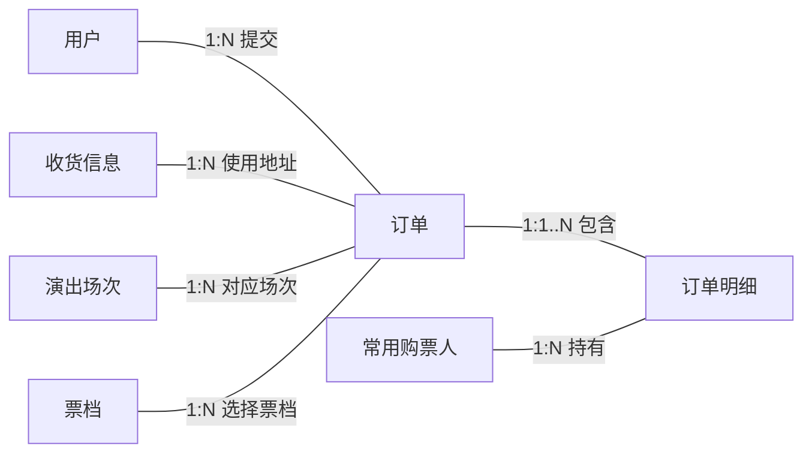
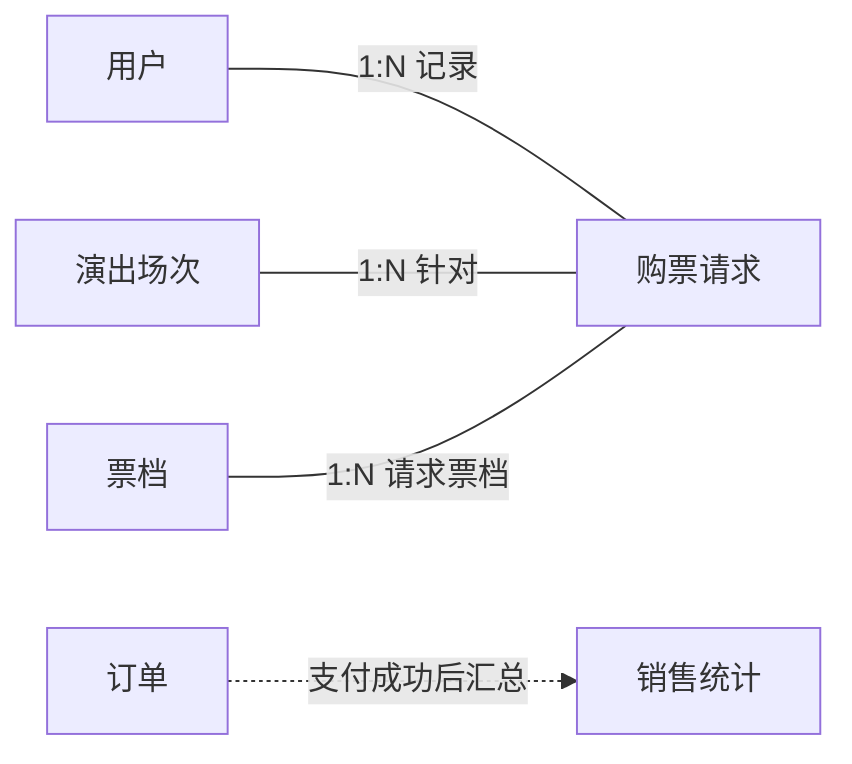
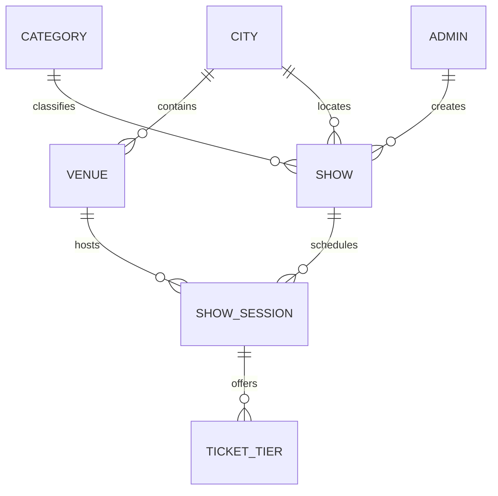
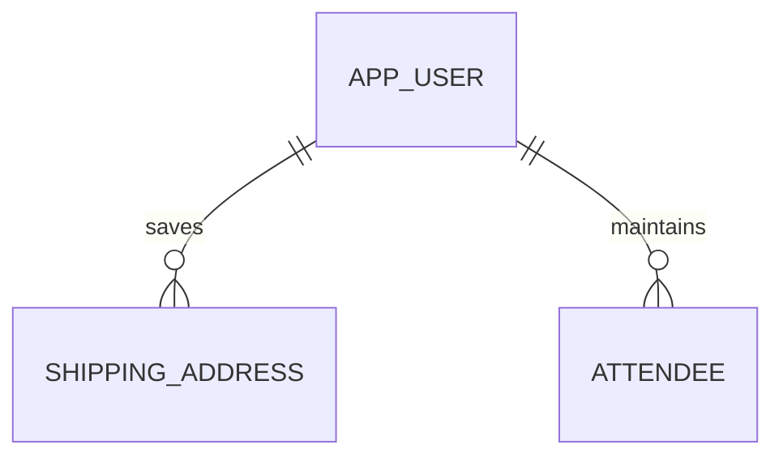
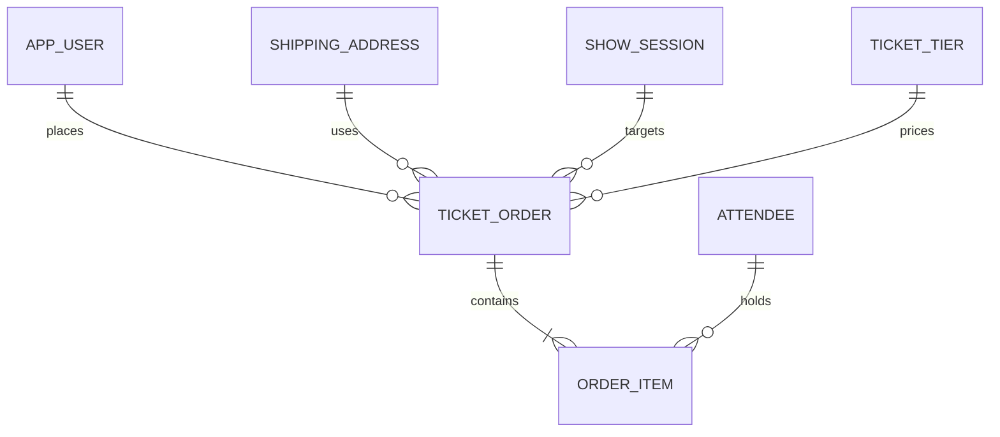
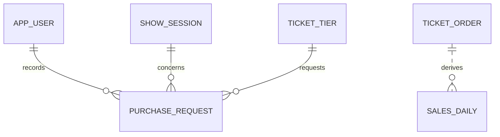

# 演出门票销售系统分域数据库模型

为减少交叉，概念模型和逻辑模型均按业务域拆分。跨图重复出现的实体只是为了表达跨域关系，数据库中仍然只有一张表。

## 概念模型

### 1. 演出基础信息

### 2. 用户资料

### 3. 订单与购票

### 4. 请求与统计

游客是访问角色，不单独作为数据库实体。

## 逻辑模型

### 1. 演出基础表

字段级主外键映射：

- `VENUE.city_id` → `CITY.city_id`
- `SHOW.category_id` → `CATEGORY.category_id`
- `SHOW.city_id` → `CITY.city_id`
- `SHOW.admin_id` → `ADMIN.admin_id`
- `SHOW_SESSION.show_id` → `SHOW.show_id`
- `SHOW_SESSION.venue_id` → `VENUE.venue_id`
- `TICKET_TIER.session_id` → `SHOW_SESSION.session_id`

### 2. 用户资料表

字段级主外键映射：

- `SHIPPING_ADDRESS.user_id` → `APP_USER.user_id`
- `ATTENDEE.user_id` → `APP_USER.user_id`

### 3. 订单交易表

字段级主外键映射：

- `TICKET_ORDER.user_id` → `APP_USER.user_id`
- `TICKET_ORDER.session_id` → `SHOW_SESSION.session_id`
- `TICKET_ORDER.tier_id` → `TICKET_TIER.tier_id`
- `TICKET_ORDER.address_id` → `SHIPPING_ADDRESS.address_id`
- `ORDER_ITEM.order_id` → `TICKET_ORDER.order_id`
- `ORDER_ITEM.attendee_id` → `ATTENDEE.attendee_id`

一致性约束：`TICKET_ORDER(session_id, tier_id)` 与 `TICKET_TIER(session_id, tier_id)` 成对对应。

### 4. 请求与统计表

说明：`PURCHASE_REQUEST.user_id`、`PURCHASE_REQUEST.session_id`、`PURCHASE_REQUEST.tier_id` 作为请求上下文记录，当前基础 DDL 未声明为物理外键；`SALES_DAILY` 为订单汇总得到的派生表。
