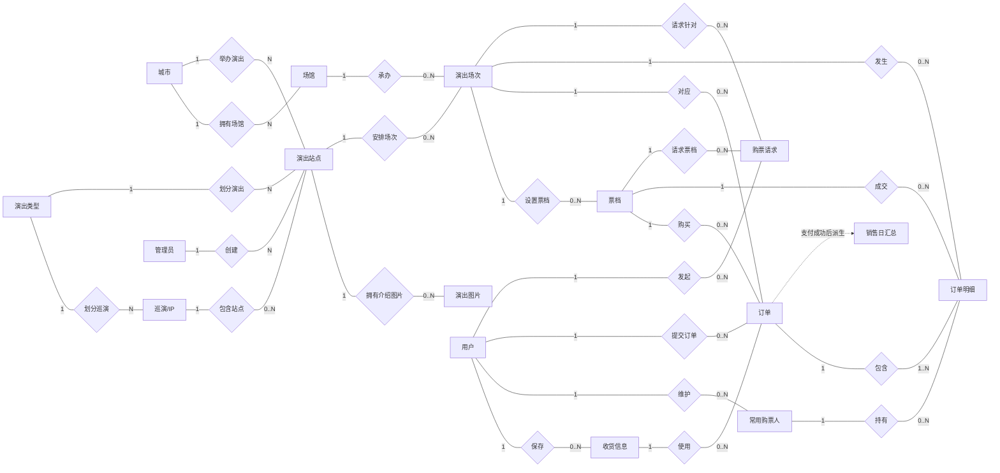

# 三、数据库设计

## 1、概念模型设计

### 1.1 建模范围与说明

本系统面向演出门票的浏览、购票、订单管理和销售统计，主要业务对象包括城市、演出类型、场馆、巡演/IP、演出、演出图片、演出场次、票档、用户、收货信息、常用购票人、订单和订单明细。管理员创建演出和场次，普通用户针对具体场次和票档提交购票请求，系统产生订单和逐张门票明细；支付成功的订单进一步形成销售日汇总。

其中，演出图片、演出场次和票档依赖所属演出或场次存在，可以在 Chen 图中作为弱实体或存在依赖实体表示；订单明细是订单与购票人的关联实体，并保存成交票档、场次和成交单价快照。购票请求是成功和失败请求的日志实体，销售日汇总是由已支付订单派生的统计实体。

### 1.2 Chen E-R 图绘制说明

绘制完整 E-R 图时，实体使用矩形，联系使用菱形，属性使用椭圆，主标识属性加下划线；联系两端标注基数。下方 Mermaid 代码给出了实体、联系和基数的布局草图，可据此在 Word、Visio 或 draw.io 中转换为 Chen 图。



### 1.3 实体及主要属性

| 实体 | 主要属性 | 说明 |
|---|---|---|
| 城市 City | **城市ID**、城市名称 | 演出和场馆的地域维度 |
| 演出类型 Category | **类型ID**、类型名称 | 演唱会、话剧歌剧、体育、儿童亲子、展览、音乐会、舞蹈芭蕾等 |
| 管理员 Admin | **管理员ID**、用户名、口令哈希、姓名、角色、创建时间 | 创建和维护演出信息 |
| 用户 AppUser | **用户ID**、用户名、口令哈希、手机号、邮箱、状态、注册时间 | 普通购票用户 |
| 场馆 Venue | **场馆ID**、城市ID、场馆名称、详细地址、座位数 | 一个场馆属于一个城市 |
| 巡演/IP Series | **巡演ID**、巡演名称、类型ID、主演/歌手、海报、介绍、创建时间 | 聚合同一内容在不同城市的站点 |
| 演出 ShowItem | **演出ID**、演出名称、类型ID、城市ID、巡演ID、海报、介绍、创建管理员、创建时间 | 某一城市的演出站点 |
| 演出图片 ShowImage | **图片ID**、演出ID、图片地址、展示顺序 | 演出介绍图片，可随演出删除 |
| 演出场次 ShowSession | **场次ID**、演出ID、场馆ID、开演时间、开售时间、售票状态 | 同一演出可以安排多个日期或时间的场次 |
| 票档 TicketTier | **票档ID**、场次ID、票档名称、单价、总票数、已售票数 | 某场次的 VIP、看台或等级票档 |
| 收货信息 ShippingAddress | **收货信息ID**、用户ID、收货人、手机号、收货地址、是否默认、创建时间 | 用户可保存多个地址 |
| 常用购票人 Attendee | **购票人ID**、用户ID、姓名、证件类型、证件号、创建时间 | 每张票绑定一位购票人 |
| 订单 TicketOrder | **订单ID**、订单号、用户ID、场次ID、票档ID、收货信息ID、票数、订单金额、订单状态、下单时间、支付时间 | 一次下单对应一个场次和一个票档 |
| 订单明细 OrderItem | **明细ID**、订单ID、票档ID、购票人ID、场次ID、成交单价 | 一行表示一张票及其持有人 |
| 购票请求 PurchaseRequest | **请求ID**、用户ID、场次ID、票档ID、请求票数、处理结果、失败原因、请求时间 | 成功和失败的购票请求均记录 |
| 销售日汇总 SalesDaily | **统计日期**、成交订单数、售票张数、销售金额 | 支付成功订单按日期汇总，属于派生统计实体 |

### 1.4 联系及基数说明

1. 城市与场馆是“一对多”联系，一个城市可以有多个场馆，一个场馆必须属于一个城市。
2. 城市与演出站点是“一对多”联系，一个城市可以举办多场演出，一个演出站点必须位于一个城市。
3. 演出类型分别与巡演/IP、演出站点形成“一对多”联系；每个巡演/IP和演出站点各属于一个演出类型。
4. 管理员与演出站点是“一对多”联系，一个管理员可以创建多场演出，一个演出站点由一个管理员创建。
5. 巡演/IP与演出站点是“一对多”联系；演出站点可以不属于任何巡演，因此演出端为 0..N，巡演端每个站点至多归属于一个巡演。
6. 演出站点与演出图片、演出场次分别是“一对多”联系。图片和场次必须依附于一个演出站点，但演出站点在尚未配置图片或场次时可以暂时没有对应记录。
7. 场馆与演出场次是“一对多”联系，一个场馆可以承办多场演出，一个场次必须在一个场馆举行。
8. 演出场次与票档是“一对多”联系，一个场次可以设置多个票档，每个票档只属于一个场次。
9. 用户与收货信息、常用购票人、订单、购票请求均为“一对多”联系。每条收货信息、购票人、订单和购票请求都属于一个用户。
10. 订单分别与演出场次、票档、收货信息形成“多对一”联系：一个订单恰好对应一个场次、一个票档和一个收货信息；同一场次、票档或收货信息可以被多个订单引用。
11. 订单与订单明细为“一对多”联系，一条订单明细表示一张票；每条明细必须属于一个订单。订单明细同时关联一个购票人、一个场次和一个票档。
12. 常用购票人与订单明细为“一对多”联系，一个购票人可以在不同场次持有多张票；通过 `(购票人ID, 场次ID)` 唯一约束实现同一购票人同一场次最多一张票。
13. 用户、演出场次、票档分别与购票请求形成“一对多”联系。购票请求即使失败也保留日志，因此其结果属性和失败原因属性用于记录处理结果。
14. 销售日汇总由支付成功的订单按支付日期派生，不直接参与购票业务。订单由待支付变为已支付时，数据库触发器累加对应日期的订单数、票数和金额。

### 1.5 关键业务约束

- 场次售票状态：`1` 表示预售中，`2` 表示售票中，`3` 表示售罄。
- 票档余票等于 `total_seats - sold_seats`，并且数据库保证 `0 <= sold_seats <= total_seats`。
- 票档单价和总票数必须大于 0；订单票数必须在 1 至 6 张之间。
- 同一场次的场次时间不能重复；同一场次的票档名称不能重复。
- 订单的场次和票档通过复合外键保持一致，防止订单引用不属于该场次的票档。
- 订单明细的场次和票档通过复合外键保持一致；`(attendee_id, session_id)` 唯一约束实现每人每场限购一张。
- 购票过程在后端事务中校验登录用户、地址和购票人归属、场次状态、余票数、购票人数和限购规则，并使用带条件的原子扣减避免并发超卖。
- `purchase_request` 保存所有购票尝试。成功请求的 `fail_reason` 为空，失败请求填写具体失败原因。

## 2、逻辑模型设计

### 2.1 关系模式总览

关系模式使用下划线表示主键，`FK` 表示外键，括号中的复合字段表示联合键。

```text
CITY(_city_id_, city_name)
CATEGORY(_category_id_, category_name)
ADMIN(_admin_id_, username, password_hash, real_name, role, create_time)
APP_USER(_user_id_, username, password_hash, phone, email, status, create_time)
VENUE(_venue_id_, city_id[FK], venue_name, address, capacity)
SHOW_SERIES(_series_id_, series_name, category_id[FK], main_artist, poster_url, description, create_time)
SHOW_ITEM(_show_id_, show_name, category_id[FK], city_id[FK], series_id[FK], poster_url, description, admin_id[FK], create_time)
SHOW_IMAGE(_image_id_, show_id[FK], image_url, sort_no)
SHOW_SESSION(_session_id_, show_id[FK], venue_id[FK], show_time, sale_start, sale_status)
TICKET_TIER(_tier_id_, session_id[FK], tier_name, price, total_seats, sold_seats)
SHIPPING_ADDRESS(_address_id_, user_id[FK], receiver_name, phone, address_detail, is_default, create_time)
ATTENDEE(_attendee_id_, user_id[FK], attendee_name, id_type, id_no, create_time)
TICKET_ORDER(_order_id_, order_no, user_id[FK], session_id[FK], tier_id[FK], address_id[FK], ticket_count, total_amount, order_status, create_time, pay_time)
ORDER_ITEM(_item_id_, order_id[FK], tier_id[FK], attendee_id[FK], session_id[FK], unit_price)
PURCHASE_REQUEST(_request_id_, user_id, session_id, tier_id, ticket_count, result, fail_reason, request_time)
SALES_DAILY(_stat_date_, order_count, ticket_count, total_amount)
```

`PURCHASE_REQUEST` 中的 `user_id`、`session_id`、`tier_id` 用于保存请求上下文并建立查询索引，当前物理表未声明外键，以保证失败日志可以独立保留；`SALES_DAILY` 是汇总表，也不设置订单外键。

### 2.2 表之间的主外键关系

| 子表 | 外键列 | 父表及父键 | 约束含义 |
|---|---|---|---|
| `venue` | `city_id` | `city(city_id)` | 场馆必须属于已有城市 |
| `show_series` | `category_id` | `category(category_id)` | 巡演/IP 必须属于已有类型 |
| `show_item` | `category_id`、`city_id`、`series_id`、`admin_id` | `category`、`city`、`show_series`、`admin` | 演出站点的类型、城市、巡演和创建者 |
| `show_image` | `show_id` | `show_item(show_id)` | 演出删除时图片级联删除 |
| `show_session` | `show_id`、`venue_id` | `show_item`、`venue` | 场次所属演出和场馆 |
| `ticket_tier` | `session_id` | `show_session(session_id)` | 票档所属场次，场次删除时级联删除 |
| `shipping_address` | `user_id` | `app_user(user_id)` | 地址所属用户，用户删除时级联删除 |
| `attendee` | `user_id` | `app_user(user_id)` | 购票人所属用户，用户删除时级联删除 |
| `ticket_order` | `user_id`、`session_id`、`tier_id`、`address_id` | `app_user`、`show_session`、`ticket_tier`、`shipping_address` | 订单主体及关联业务数据 |
| `ticket_order` | `(session_id, tier_id)` | `ticket_tier(session_id, tier_id)` | 保证订单票档属于订单场次 |
| `order_item` | `order_id`、`tier_id`、`attendee_id` | `ticket_order`、`ticket_tier`、`attendee` | 明细所属订单、票档和购票人 |
| `order_item` | `(session_id, tier_id)` | `ticket_tier(session_id, tier_id)` | 保证明细票档属于明细场次 |

### 2.3 主要唯一约束与索引

| 表 | 约束或索引 | 用途 |
|---|---|---|
| `city` | `UNIQUE(city_name)` | 城市名称不能重复 |
| `category` | `UNIQUE(category_name)` | 类型名称不能重复 |
| `admin` | `UNIQUE(username)` | 管理员用户名唯一 |
| `app_user` | `UNIQUE(username)`、`UNIQUE(phone)` | 用户名和手机号唯一 |
| `venue` | `UNIQUE(city_id, venue_name)` | 同一城市内场馆名称唯一 |
| `show_series` | `UNIQUE(series_name)` | 巡演/IP 名称唯一 |
| `show_session` | `UNIQUE(show_id, show_time)` | 同一演出同一时间只能有一个场次 |
| `ticket_tier` | `UNIQUE(session_id, tier_name)` | 同一场次票档名称唯一 |
| `attendee` | `UNIQUE(user_id, id_type, id_no)` | 同一用户不能重复保存同一证件 |
| `ticket_order` | `UNIQUE(order_no)` | 业务订单号唯一 |
| `order_item` | `UNIQUE(attendee_id, session_id)` | 每个购票人每个场次最多一张票 |

## 3、数据字典

### 3.1 城市表 `city`

| 列名 | 类型 | 约束 | 备注 |
|---|---|---|---|
| `city_id` | `SMALLINT` | 主键、非空、自增 | 城市唯一编号 |
| `city_name` | `VARCHAR(50)` | 非空、唯一 | 城市名称 |

### 3.2 演出类型表 `category`

| 列名 | 类型 | 约束 | 备注 |
|---|---|---|---|
| `category_id` | `TINYINT` | 主键、非空、自增 | 类型编号 |
| `category_name` | `VARCHAR(20)` | 非空、唯一 | 演出类型名称 |

### 3.3 管理员表 `admin`

| 列名 | 类型 | 约束 | 备注 |
|---|---|---|---|
| `admin_id` | `INT` | 主键、非空、自增 | 管理员编号 |
| `username` | `VARCHAR(50)` | 非空、唯一 | 管理员登录名 |
| `password_hash` | `CHAR(60)` | 非空 | bcrypt 口令哈希，不保存明文口令 |
| `real_name` | `VARCHAR(50)` | 可空 | 管理员姓名 |
| `role` | `TINYINT` | 非空，默认 1 | `1` 普通管理员，`9` 超级管理员 |
| `create_time` | `DATETIME` | 非空，默认当前时间 | 创建时间 |

### 3.4 用户表 `app_user`

| 列名 | 类型 | 约束 | 备注 |
|---|---|---|---|
| `user_id` | `BIGINT` | 主键、非空、自增 | 用户编号 |
| `username` | `VARCHAR(50)` | 非空、唯一 | 登录用户名 |
| `password_hash` | `CHAR(60)` | 非空 | bcrypt 口令哈希 |
| `phone` | `VARCHAR(20)` | 非空、唯一 | 手机号 |
| `email` | `VARCHAR(100)` | 可空 | 电子邮箱 |
| `status` | `TINYINT` | 非空，默认 1 | `1` 正常，`0` 冻结 |
| `create_time` | `DATETIME` | 非空，默认当前时间 | 注册时间 |

### 3.5 场馆表 `venue`

| 列名 | 类型 | 约束 | 备注 |
|---|---|---|---|
| `venue_id` | `INT` | 主键、非空、自增 | 场馆编号 |
| `city_id` | `SMALLINT` | 非空、外键 | 引用 `city.city_id` |
| `venue_name` | `VARCHAR(100)` | 非空 | 场馆名称 |
| `address` | `VARCHAR(200)` | 非空 | 场馆详细地址 |
| `capacity` | `INT` | 非空，默认 0 | 场馆座位数 |

### 3.6 巡演/IP 表 `show_series`

| 列名 | 类型 | 约束 | 备注 |
|---|---|---|---|
| `series_id` | `INT` | 主键、非空、自增 | 巡演/IP 编号 |
| `series_name` | `VARCHAR(100)` | 非空、唯一 | 巡演或 IP 名称 |
| `category_id` | `TINYINT` | 非空、外键 | 引用 `category.category_id` |
| `main_artist` | `VARCHAR(50)` | 可空 | 主演、歌手或主要艺人 |
| `poster_url` | `VARCHAR(255)` | 可空 | 巡演海报地址 |
| `description` | `TEXT` | 可空 | 巡演/IP 介绍 |
| `create_time` | `DATETIME` | 非空，默认当前时间 | 创建时间 |

### 3.7 演出表 `show_item`

| 列名 | 类型 | 约束 | 备注 |
|---|---|---|---|
| `show_id` | `INT` | 主键、非空、自增 | 演出站点编号 |
| `show_name` | `VARCHAR(100)` | 非空 | 演出名称 |
| `category_id` | `TINYINT` | 非空、外键 | 引用 `category.category_id` |
| `city_id` | `SMALLINT` | 非空、外键 | 演出所在城市 |
| `series_id` | `INT` | 可空、外键 | 所属巡演/IP；独立演出可为空 |
| `poster_url` | `VARCHAR(255)` | 可空 | 演出海报地址 |
| `description` | `TEXT` | 可空 | 演出文字介绍 |
| `admin_id` | `INT` | 非空、外键 | 创建该演出的管理员 |
| `create_time` | `DATETIME` | 非空，默认当前时间 | 创建时间 |

### 3.8 演出图片表 `show_image`

| 列名 | 类型 | 约束 | 备注 |
|---|---|---|---|
| `image_id` | `BIGINT` | 主键、非空、自增 | 图片编号 |
| `show_id` | `INT` | 非空、外键 | 引用 `show_item.show_id`，级联删除 |
| `image_url` | `VARCHAR(255)` | 非空 | 图片地址 |
| `sort_no` | `TINYINT` | 非空，默认 0 | 图片展示顺序 |

### 3.9 演出场次表 `show_session`

| 列名 | 类型 | 约束 | 备注 |
|---|---|---|---|
| `session_id` | `INT` | 主键、非空、自增 | 场次编号 |
| `show_id` | `INT` | 非空、外键 | 引用 `show_item.show_id`，级联删除 |
| `venue_id` | `INT` | 非空、外键 | 举办场馆 |
| `show_time` | `DATETIME` | 非空 | 开演日期和时间 |
| `sale_start` | `DATETIME` | 非空 | 开售日期和时间 |
| `sale_status` | `TINYINT` | 非空，默认 1 | `1` 预售中，`2` 售票中，`3` 售罄 |

### 3.10 票档表 `ticket_tier`

| 列名 | 类型 | 约束 | 备注 |
|---|---|---|---|
| `tier_id` | `BIGINT` | 主键、非空、自增 | 票档编号 |
| `session_id` | `INT` | 非空、外键 | 所属演出场次，级联删除 |
| `tier_name` | `VARCHAR(50)` | 非空 | 票档名称，如 VIP、看台等 |
| `price` | `DECIMAL(8,2)` | 非空，`> 0` | 票面单价 |
| `total_seats` | `INT` | 非空，`> 0` | 该票档总票数 |
| `sold_seats` | `INT` | 非空，默认 0，`0 <= sold <= total` | 已售票数 |

### 3.11 收货信息表 `shipping_address`

| 列名 | 类型 | 约束 | 备注 |
|---|---|---|---|
| `address_id` | `BIGINT` | 主键、非空、自增 | 收货信息编号 |
| `user_id` | `BIGINT` | 非空、外键 | 所属用户，用户删除时级联删除 |
| `receiver_name` | `VARCHAR(50)` | 非空 | 收货人姓名 |
| `phone` | `VARCHAR(20)` | 非空 | 收货手机号 |
| `address_detail` | `VARCHAR(200)` | 非空 | 详细收货地址 |
| `is_default` | `TINYINT` | 非空，默认 0 | `1` 默认地址，`0` 非默认地址 |
| `create_time` | `DATETIME` | 非空，默认当前时间 | 创建时间 |

### 3.12 常用购票人表 `attendee`

| 列名 | 类型 | 约束 | 备注 |
|---|---|---|---|
| `attendee_id` | `BIGINT` | 主键、非空、自增 | 购票人编号 |
| `user_id` | `BIGINT` | 非空、外键 | 所属用户，用户删除时级联删除 |
| `attendee_name` | `VARCHAR(50)` | 非空 | 购票人姓名 |
| `id_type` | `TINYINT` | 非空 | `1` 身份证，`2` 护照，`3` 港澳通行证，`4` 台胞证，`5` 军官证 |
| `id_no` | `VARCHAR(30)` | 非空 | 证件号码 |
| `create_time` | `DATETIME` | 非空，默认当前时间 | 创建时间 |

### 3.13 订单表 `ticket_order`

| 列名 | 类型 | 约束 | 备注 |
|---|---|---|---|
| `order_id` | `BIGINT` | 主键、非空、自增 | 订单内部编号 |
| `order_no` | `VARCHAR(32)` | 非空、唯一 | 对外展示的业务订单号 |
| `user_id` | `BIGINT` | 非空、外键 | 下单用户 |
| `session_id` | `INT` | 非空、外键 | 购买的演出场次 |
| `tier_id` | `BIGINT` | 非空、外键 | 购买的票档 |
| `address_id` | `BIGINT` | 非空、外键 | 订单使用的收货信息 |
| `ticket_count` | `INT` | 非空，`1 <= count <= 6` | 本次购买票数 |
| `total_amount` | `DECIMAL(10,2)` | 非空 | 订单金额快照 |
| `order_status` | `TINYINT` | 非空，默认 1 | `1` 待支付，`2` 已支付，`3` 已取消，`4` 已退款 |
| `create_time` | `DATETIME` | 非空，默认当前时间 | 下单时间 |
| `pay_time` | `DATETIME` | 可空 | 支付时间，未支付时为空 |

### 3.14 订单明细表 `order_item`

| 列名 | 类型 | 约束 | 备注 |
|---|---|---|---|
| `item_id` | `BIGINT` | 主键、非空、自增 | 明细编号 |
| `order_id` | `BIGINT` | 非空、外键 | 所属订单，订单删除时级联删除 |
| `tier_id` | `BIGINT` | 非空、外键 | 成交票档 |
| `attendee_id` | `BIGINT` | 非空、外键 | 该张票的购票人 |
| `session_id` | `INT` | 非空 | 场次冗余字段，用于联合外键和限购约束 |
| `unit_price` | `DECIMAL(8,2)` | 非空 | 成交单价快照，避免票档改价影响历史订单 |

### 3.15 购票请求日志表 `purchase_request`

| 列名 | 类型 | 约束 | 备注 |
|---|---|---|---|
| `request_id` | `BIGINT` | 主键、非空、自增 | 请求编号 |
| `user_id` | `BIGINT` | 非空 | 发起请求的用户编号；保留请求上下文 |
| `session_id` | `INT` | 非空 | 请求的演出场次编号 |
| `tier_id` | `BIGINT` | 非空 | 请求的票档编号 |
| `ticket_count` | `INT` | 非空 | 请求购买票数 |
| `result` | `TINYINT` | 非空 | `1` 成功，`0` 失败 |
| `fail_reason` | `VARCHAR(100)` | 可空 | 失败原因；成功时为空 |
| `request_time` | `DATETIME` | 非空，默认当前时间 | 请求发生时间 |

### 3.16 销售日汇总表 `sales_daily`

| 列名 | 类型 | 约束 | 备注 |
|---|---|---|---|
| `stat_date` | `DATE` | 主键、非空 | 统计日期 |
| `order_count` | `INT` | 非空，默认 0 | 当日已支付订单数 |
| `ticket_count` | `INT` | 非空，默认 0 | 当日已售票数 |
| `total_amount` | `DECIMAL(12,2)` | 非空，默认 0.00 | 当日销售金额 |

### 3.17 业务视图

以下对象不是独立存储的基本关系，而是面向查询的逻辑视图：

| 视图 | 用途 | 主要内容 |
|---|---|---|
| `v_show_list` | 演出列表 | 演出名称、城市、类型、场馆、最近场次、日期串、价格区间和聚合售票状态 |
| `v_tier_stock` | 演出详情与购票 | 票档总票数、已售票数、余票数和售罄标记 |
| `v_order_detail` | 我的订单 | 订单信息、演出、场馆、城市、场次时间和收货信息的联接结果 |

## 四、SQL语句

### 1、数据库初始化

本系统使用 MySQL 8.0、InnoDB 存储引擎和 `utf8mb4` 字符集。新建数据库所需 SQL 只有以下两个正式入口：

| 文件 | 内容 |
|---|---|
| `sql/schema/ddl.sql` | 删除并重建数据库，创建数据表、约束、索引、触发器、事件和视图 |
| `sql/seed/seed_data.sql` | 清空业务表，插入字典、用户、演出、巡演/IP、场次、票档和订单数据 |

#### （1）建库建表

执行 `ddl.sql` 后，系统创建数据库 `ticket_sales`。脚本开头的建库语句如下：

```sql
DROP DATABASE IF EXISTS ticket_sales;
CREATE DATABASE ticket_sales
  DEFAULT CHARACTER SET utf8mb4
  COLLATE utf8mb4_0900_ai_ci;
USE ticket_sales;
```

随后创建 16 张基本表：`city`、`category`、`admin`、`app_user`、`venue`、`show_series`、`show_item`、`show_image`、`show_session`、`ticket_tier`、`shipping_address`、`attendee`、`ticket_order`、`order_item`、`purchase_request` 和 `sales_daily`。各表的完整 `CREATE TABLE` 语句、主键、外键、唯一键、检查约束和索引均已写入 `sql/schema/ddl.sql`。

其中，演出图片、场次和票档分别依赖演出或场次；订单明细通过订单、票档和购票人外键与交易数据关联；`UNIQUE(attendee_id, session_id)` 用于实现同一购票人同一场次限购一张；票档表的检查约束保证价格、总票数和已售票数合法。脚本还创建 `trg_order_paid_insert`、`trg_order_paid` 两个销售汇总触发器，以及 `v_show_list`、`v_tier_stock`、`v_order_detail` 三个业务视图。

#### （2）初始数据插入

执行 `seed_data.sql` 时，脚本先关闭外键检查并清空业务表，再按依赖关系插入数据，主要语句顺序为：

```text
城市和类型 -> 管理员和场馆 -> 演出及图片 -> 场次和票档
-> 用户、收货地址和购票人 -> 订单及订单明细 -> 购票请求日志 -> 销售日汇总
```

基础数据包括 12 个城市、7 种演出类型、1 个管理员、15 个场馆、7 个演出站点、12 个演出场次、49 个票档、5 个普通用户、6 条收货地址、10 个常用购票人、9 笔订单、15 条订单明细和 9 条购票请求日志。场次时间使用 `NOW()` 和相对日期函数生成，能够展示预售中、售票中和售罄等状态。

当前完整的系列/IP 示例数据已合并进 `seed_data.sql`。历史脚本 `sql/archive/phase4_seed_series.sql` 保留用于追溯旧版数据导入流程，不要在新库初始化后重复运行。系列海报直接使用 `poster_collect/` 提供的路由地址，例如：

```sql
INSERT INTO show_series
  (series_id, series_name, category_id, main_artist, poster_url, description)
VALUES
  (1, '周杰伦《嘉年华》世界巡回演唱会', 1, '周杰伦',
   '/posters/D/series_069_poster.jpg', '周杰伦世界巡回演唱会');

UPDATE show_item SET series_id = 1 WHERE show_id = 1;
```

其余城市、演出、场次、票档、用户和订单的完整 `INSERT INTO` 语句均在 `sql/seed/seed_data.sql` 中，可直接运行。演示账号的口令约定为 `123456`，数据库中保存的是 bcrypt 占位哈希。

#### （3）执行方式与检查

两个脚本必须按以下顺序执行：

```bash
mysql -h 127.0.0.1 -P 3306 -u root -p < sql/schema/ddl.sql
mysql -h 127.0.0.1 -P 3306 -u root -p < sql/seed/seed_data.sql
```

执行完成后，可使用以下语句检查初始化结果：

```sql
USE ticket_sales;
SELECT COUNT(*) AS table_count
FROM information_schema.tables
WHERE table_schema = 'ticket_sales' AND table_type = 'BASE TABLE';
SELECT COUNT(*) AS show_count FROM show_item;
SELECT COUNT(*) AS session_count FROM show_session;
SELECT COUNT(*) AS order_count FROM ticket_order;
SELECT * FROM v_show_list LIMIT 5;
```

`ddl.sql` 会删除并重建整个数据库，`seed_data.sql` 会清空并重新插入业务数据，因此这三份脚本适用于首次初始化或重置演示数据库，执行前应备份需要保留的数据。
